Comprehensive Genomic Analysis of Somatic Mutations in Head and Neck
Cancer (HNC)
================
Ankur Meshram
2025-06-18

### Introduction

Understanding the genetic changes in tumors is a crucial component of
developing precision medicine strategies. In this project, we will use
publicly accessible data (likely cBioPortal or TCGA) to perform an
analysis of mutation data of cancer patients in different categories.
The analysis represents clinical survival analysis, mutation landscape
visualization, copy number alteration (CNA) profiling, comparison of
tumor mutational burden (TMB), pathway enrichment analysis, and
identification of gene fusions and mutational signatures.

### Objectives

- Perform survival analysis based on HPV status.
- Visualize variant allele frequency (VAF) and mutation types.
- Identify significantly mutated genes and driver genes.
- Analyze and visualize copy number alterations.
- Compare tumor mutational burden (TMB) across patient groups.
- Conduct gene ontology (GO) and KEGG pathway enrichment analysis.
- Explore structural variants and gene fusions.
- Analyze mutational signatures from somatic mutations.

### Workflow

### 1. Clinical Summary and Survival Analysis

``` r
# Dataset Link - https://www.cbioportal.org/study/summary?id=hnc_mskcc_2016
# Head and Neck Cancer (HNC), HPV (Human Papillomavirus)

setwd("C:/Ankur_IIITD/cancer_genomics/HNC")
list.files()
```

    ## [1] "hnc_mskcc_2016"               "mutation_data_analysis.html"  "mutation_data_analysis.md"   
    ## [4] "mutation_data_analysis.R"     "mutation_data_analysis.Rmd"   "mutation_data_analysis_files"
    ## [7] "Readme.md"

``` r
# Load required packages
library(survival)
library(survminer)
library(dplyr)
```

``` r
# Load clinical patients data 
clin.patient <- read.delim("hnc_mskcc_2016/data_clinical_patient.txt", skip = 4)
clin.patient <- clin.patient %>%
  mutate(OS_MONTHS = as.numeric(OS_MONTHS),
         OS_STATUS = ifelse(grepl("DECEASED", OS_STATUS), 1, 0))
```

``` r
# Overall Survival (OS) Kaplan-Meier Plot
fit <- survfit(Surv(OS_MONTHS, OS_STATUS) ~ HPV_STATUS, data = clin.patient)
ggsurvplot(fit, data = clin.patient, pval = TRUE,
           title = "Overall Survival by HPV Status")
```

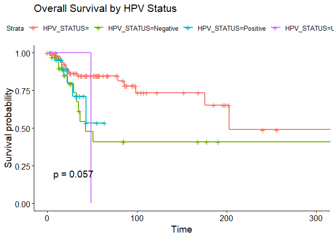<!-- -->

Patients with HPV_STATUS=Positive appear to have a generally better
overall survival probability over time compared to those with
HPV_STATUS=Negative.

HPV_STATUS=Unknown and HPV_STATUS= groups has very limited data, making
it hard to draw conclusions.

p-value=0.057 is close to traditional significance level of of 0.05,
suggests that there is a trend towards a statistically significant
difference in overall survival between the groups.

### 2. Mutation Landscape Overview

``` r
# Load required packages
library(maftools)
library(data.table)
```

``` r
# Calculate and plot VAF 
mutations <- fread("hnc_mskcc_2016/data_mutations.txt")
t_alt_count <- mutations$t_alt_count
t_ref_count <- mutations$t_ref_count
vaf <- t_alt_count / (t_ref_count + t_alt_count)
mutations <- cbind(mutations, vaf)
maf <- read.maf(maf = mutations)
```

    ## -Validating
    ## -Silent variants: 38 
    ## -Summarizing
    ## --Mutiple centers found
    ## MSKCC;-Processing clinical data
    ## --Missing clinical data
    ## -Finished in 0.080s elapsed (0.050s cpu)

``` r
plotVaf(maf = maf, vafCol = 'vaf')
```

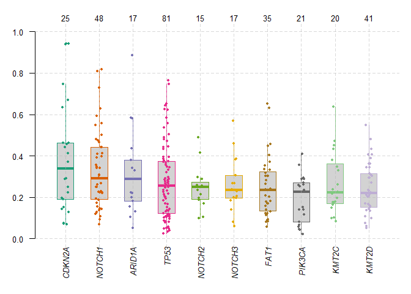<!-- -->

This plot highlights TP53 as the most frequently mutated gene in this
dataset and suggests that CDKN2A and NOTCH1 mutations tend to occur at
higher VAFs, potentially indicating they are more frequently clonal
events compared to genes like NOTCH2 or NOTCH3.

``` r
# Data summary
plotmafSummary(maf)
```

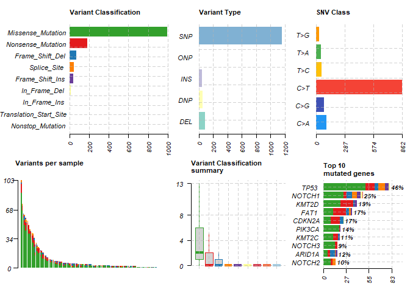<!-- -->

Missense Mutations are by far the most common type of variant,
accounting for over 900 instances.

Single Nucleotide Polymorphisms (SNPs) are overwhelmingly the most
common type of variant, with over 1000 instances.

C\>T (Cytosine to Thymine) transitions are the most frequent single
nucleotide variant class, with over 800 occurrences.

Variants per sample plot shows a distribution where most samples have a
relatively low number of variants. (Gives idea about total mutation
burden i.e. TMB)

The median number of missense mutations per sample is around 2, with
some samples having significantly more (outliers).

TP53 is the most frequently mutated gene, with over 60 mutations
detected, affecting 46% of the samples. The different colored segments
within the TP53 bar represent the different variant classifications
found in that gene.

``` r
# The oncoplot 
oncoplot(maf = maf, top = 20, sortByAnnotation = TRUE)
```

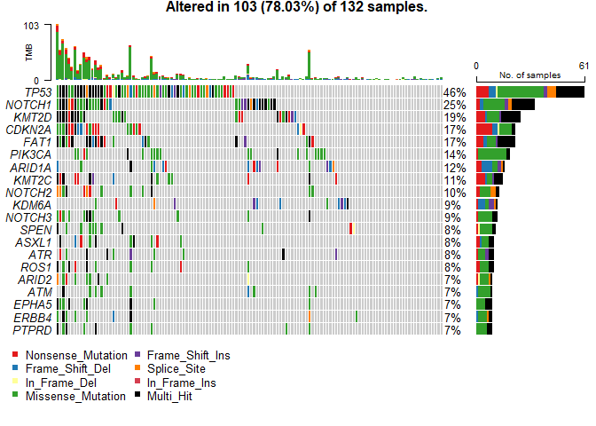<!-- -->

The oncoplot strongly points to TP53, NOTCH1, KMT2D, CDKN2A, FAT1, and
PIK3CA as key driver genes in our HNC dataset due to their high
alteration frequencies.

``` r
# Lollipop plot to represent functional amino acid mutations
lollipopPlot(maf = maf, gene = "TP53", AACol = "MA:protein.change", showMutationRate = TRUE)
```

    ## 8 transcripts available. Use arguments refSeqID or proteinID to manually specify tx name.

    ##      HGNC    refseq.ID   protein.ID aa.length
    ##    <char>       <char>       <char>     <num>
    ## 1:   TP53    NM_000546    NP_000537       393
    ## 2:   TP53 NM_001126112 NP_001119584       393
    ## 3:   TP53 NM_001126113 NP_001119585       346
    ## 4:   TP53 NM_001126114 NP_001119586       341
    ## 5:   TP53 NM_001126115 NP_001119587       261
    ## 6:   TP53 NM_001126116 NP_001119588       209
    ## 7:   TP53 NM_001126117 NP_001119589       214
    ## 8:   TP53 NM_001126118 NP_001119590       354

    ## Using longer transcript NM_000546 for now.

    ## Removed 24 mutations for which AA position was not available

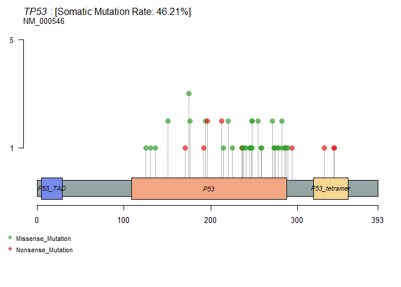<!-- -->

Lollipop plot visualizes the distribution of somatic mutations within
the TP53 gene.

TP53 protein has three main domain -

1.  **P53_TAD (p53 Transactivation Domain):** Located at the N-terminus
    (roughly amino acids 1-60). This domain is crucial for initiating
    transcription of target genes.

2.  **P53 (DNA Binding Domain):** The large orange box, spanning
    approximately amino acids 100-300. This is the core domain
    responsible for binding to DNA and regulating gene expression. This
    domain is frequently targeted by mutations.

3.  **P53_tetramer (Oligomerization Domain):** Located at the C-terminus
    (roughly amino acids 320-360). This domain is responsible for the
    formation of p53 tetramers, which is essential for its tumor
    suppressor activity.

### 3. Driver Gene and Functional Mutation Analysis

``` r
# Finding driver genes
maf.drivers <- oncodrive(maf, AACol = "MA:protein.change", minMut = 5, pvalMethod = 'zscore')
```

    ## Warning in oncodrive(maf, AACol = "MA:protein.change", minMut = 5, pvalMethod = "zscore"): Oncodrive has been superseeded
    ## by OncodriveCLUSTL. See http://bg.upf.edu/group/projects/oncodrive-clust.php

    ## Estimating background scores from synonymous variants..

    ## Not enough genes to build background. Using predefined values. (Mean = 0.279; SD = 0.13)

    ## Estimating cluster scores from non-syn variants..

    ##   |                                                                                                                          |                                                                                                                  |   0%  |                                                                                                                          |=                                                                                                                 |   1%  |                                                                                                                          |==                                                                                                                |   2%  |                                                                                                                          |====                                                                                                              |   3%  |                                                                                                                          |=====                                                                                                             |   4%  |                                                                                                                          |======                                                                                                            |   5%  |                                                                                                                          |=======                                                                                                           |   7%  |                                                                                                                          |=========                                                                                                         |   8%  |                                                                                                                          |==========                                                                                                        |   9%  |                                                                                                                          |===========                                                                                                       |  10%  |                                                                                                                          |============                                                                                                      |  11%  |                                                                                                                          |==============                                                                                                    |  12%  |                                                                                                                          |===============                                                                                                   |  13%  |                                                                                                                          |================                                                                                                  |  14%  |                                                                                                                          |=================                                                                                                 |  15%  |                                                                                                                          |===================                                                                                               |  16%  |                                                                                                                          |====================                                                                                              |  17%  |                                                                                                                          |=====================                                                                                             |  18%  |                                                                                                                          |======================                                                                                            |  20%  |                                                                                                                          |========================                                                                                          |  21%  |                                                                                                                          |=========================                                                                                         |  22%  |                                                                                                                          |==========================                                                                                        |  23%  |                                                                                                                          |===========================                                                                                       |  24%  |                                                                                                                          |============================                                                                                      |  25%  |                                                                                                                          |==============================                                                                                    |  26%  |                                                                                                                          |===============================                                                                                   |  27%  |                                                                                                                          |================================                                                                                  |  28%  |                                                                                                                          |=================================                                                                                 |  29%  |                                                                                                                          |===================================                                                                               |  30%  |                                                                                                                          |====================================                                                                              |  32%  |                                                                                                                          |=====================================                                                                             |  33%  |                                                                                                                          |======================================                                                                            |  34%  |                                                                                                                          |========================================                                                                          |  35%  |                                                                                                                          |=========================================                                                                         |  36%  |                                                                                                                          |==========================================                                                                        |  37%  |                                                                                                                          |===========================================                                                                       |  38%  |                                                                                                                          |=============================================                                                                     |  39%  |                                                                                                                          |==============================================                                                                    |  40%  |                                                                                                                          |===============================================                                                                   |  41%  |                                                                                                                          |================================================                                                                  |  42%  |                                                                                                                          |==================================================                                                                |  43%  |                                                                                                                          |===================================================                                                               |  45%  |                                                                                                                          |====================================================                                                              |  46%  |                                                                                                                          |=====================================================                                                             |  47%  |                                                                                                                          |=======================================================                                                           |  48%  |                                                                                                                          |========================================================                                                          |  49%  |                                                                                                                          |=========================================================                                                         |  50%  |                                                                                                                          |==========================================================                                                        |  51%  |                                                                                                                          |===========================================================                                                       |  52%  |                                                                                                                          |=============================================================                                                     |  53%  |                                                                                                                          |==============================================================                                                    |  54%  |                                                                                                                          |===============================================================                                                   |  55%  |                                                                                                                          |================================================================                                                  |  57%  |                                                                                                                          |==================================================================                                                |  58%  |                                                                                                                          |===================================================================                                               |  59%  |                                                                                                                          |====================================================================                                              |  60%  |                                                                                                                          |=====================================================================                                             |  61%  |                                                                                                                          |=======================================================================                                           |  62%  |                                                                                                                          |========================================================================                                          |  63%  |                                                                                                                          |=========================================================================                                         |  64%  |                                                                                                                          |==========================================================================                                        |  65%  |                                                                                                                          |============================================================================                                      |  66%  |                                                                                                                          |=============================================================================                                     |  67%  |                                                                                                                          |==============================================================================                                    |  68%  |                                                                                                                          |===============================================================================                                   |  70%  |                                                                                                                          |=================================================================================                                 |  71%  |                                                                                                                          |==================================================================================                                |  72%  |                                                                                                                          |===================================================================================                               |  73%  |                                                                                                                          |====================================================================================                              |  74%  |                                                                                                                          |======================================================================================                            |  75%  |                                                                                                                          |=======================================================================================                           |  76%  |                                                                                                                          |========================================================================================                          |  77%  |                                                                                                                          |=========================================================================================                         |  78%  |                                                                                                                          |==========================================================================================                        |  79%  |                                                                                                                          |============================================================================================                      |  80%  |                                                                                                                          |=============================================================================================                     |  82%  |                                                                                                                          |==============================================================================================                    |  83%  |                                                                                                                          |===============================================================================================                   |  84%  |                                                                                                                          |=================================================================================================                 |  85%  |                                                                                                                          |==================================================================================================                |  86%  |                                                                                                                          |===================================================================================================               |  87%  |                                                                                                                          |====================================================================================================              |  88%  |                                                                                                                          |======================================================================================================            |  89%  |                                                                                                                          |=======================================================================================================           |  90%  |                                                                                                                          |========================================================================================================          |  91%  |                                                                                                                          |=========================================================================================================         |  92%  |                                                                                                                          |===========================================================================================================       |  93%  |                                                                                                                          |============================================================================================================      |  95%  |                                                                                                                          |=============================================================================================================     |  96%  |                                                                                                                          |==============================================================================================================    |  97%  |                                                                                                                          |================================================================================================================  |  98%  |                                                                                                                          |================================================================================================================= |  99%  |                                                                                                                          |==================================================================================================================| 100%

    ## Comapring with background model and estimating p-values..

    ## Done !

``` r
plotOncodrive(res = maf.drivers, fdrCutOff = 0.5, useFraction = TRUE, labelSize = 0.5)
```

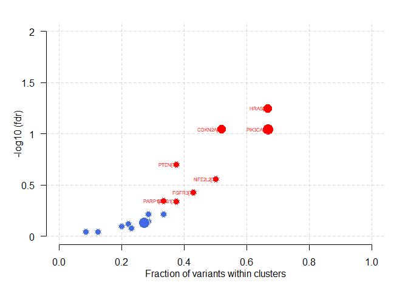<!-- -->

Driver genes are the genes that are most likely to be oncogenic drivers
by evaluating both the positional distribution (clustering) and the
predicted functional consequence of their mutations across a cohort.

Genes appearing in the top-right (red coloured) - HRAS, CDKN2A, PIK3CA,
PTEN, NFE2L2, FGFR3, PARP1 and SF3B1, are strong candidates for further
investigation as key players in the cancer being studied.

``` r
# Adding and summarizing pfam domains
maf.pfam = pfamDomains(maf, AACol = 'MA:protein.change', top = 10)
```

    ## Warning in pfamDomains(maf, AACol = "MA:protein.change", top = 10): Removed 242 mutations for which AA position was not
    ## available

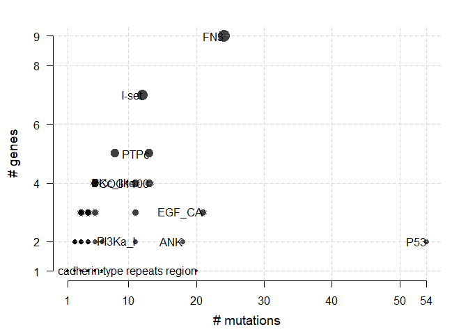<!-- -->

``` r
maf.pfam$proteinSummary[, 1:7, with = FALSE]
```

    ##         HGNC AAPos Variant_Classification     N total   fraction                  DomainLabel
    ##       <char> <num>                 <fctr> <int> <num>      <num>                       <char>
    ##    1: PIK3CA   545      Missense_Mutation     5    21 0.23809524                      PI3Ka_I
    ##    2:   TP53   248      Missense_Mutation     5    81 0.06172840                          P53
    ##    3: CDKN2A   125      Nonsense_Mutation     3    25 0.12000000                          ANK
    ##    4: CDKN2A    94      Nonsense_Mutation     3    25 0.12000000                          ANK
    ##    5:   FAT1  2726      Nonsense_Mutation     3    35 0.08571429 cadherin-type repeats region
    ##   ---                                                                                        
    ## 1050:  ZFHX3  1942      Missense_Mutation     1     8 0.12500000                         <NA>
    ## 1051:  ZFHX3   552      Missense_Mutation     1     8 0.12500000                         <NA>
    ## 1052:  ZFHX3   421      Missense_Mutation     1     8 0.12500000                         <NA>
    ## 1053:  ZFHX3  1649      Missense_Mutation     1     8 0.12500000                         <NA>
    ## 1054:  ZFHX3  3616      Missense_Mutation     1     8 0.12500000                         <NA>

``` r
maf.pfam$domainSummary[, 1:5, with = FALSE]
```

    ##                       DomainLabel nMuts nGenes
    ##                            <char> <int>  <int>
    ##   1:                          P53    54      2
    ##   2:                          FN3    24      9
    ##   3:                       EGF_CA    21      3
    ##   4: cadherin-type repeats region    20      1
    ##   5:                          ANK    18      2
    ##  ---                                          
    ## 218:                 recomb_RAD51     1      1
    ## 219:                   zf-C3HC4_2     1      1
    ## 220:                   zf-HC5HC2H     1      1
    ## 221:                       zf-TAZ     1      1
    ## 222:           zinc finger domain     1      1
    ##                                                                                                                                                                                                                                            pfam
    ##                                                                                                                                                                                                                                          <char>
    ##   1:                                                                                                                                                                                                                                    cd08367
    ##   2:           One of three types of internal repeats found in the plasma protein fibronectin. Its tenth fibronectin type III repeat contains an RGD cell recognition sequence in a flexible loop between 2 strands. Approximately 2% of all...
    ##   3:                                                                                                                                                                                                                                    cd00054
    ##   4:                                                                                                                                                                                                                                       <NA>
    ##   5: ankyrin repeats mediate protein-protein interactions in very diverse families of proteins. The number of ANK repeats in a protein can range from 2 to over 20 (ankyrins, for example). ANK repeats may occur in combinations with other...
    ##  ---                                                                                                                                                                                                                                           
    ## 218:                                                                                                                                                                                                                                  TIGR02239
    ## 219:                                                                                                                                                                                                                                  pfam13923
    ## 220:                                                                                                                                                                                                                                  pfam13771
    ## 221:                                                                                                                                                                                                                                  pfam02135
    ## 222:                                                                                                                                                                                                                                       <NA>
    ##                                                                                                                                                                                                                                                          Description
    ##                                                                                                                                                                                                                                                               <char>
    ##   1:                                                                                                                                                                                                                                          P53 DNA-binding domain
    ##   2:                                                                                                                                                                                                                                       Fibronectin type 3 domain
    ##   3: Calcium-binding EGF-like domain, present in a large number of membrane-bound and extracellular (mostly animal) proteins. Many of these proteins require calcium for their biological function and calcium-binding sites have been found to be located at the...
    ##   4:                                                                                                                                                                                                                                                            <NA>
    ##   5:                                                                                                                                                                                                                                                 ankyrin repeats
    ##  ---                                                                                                                                                                                                                                                                
    ## 218:                                                                                                                                                                                                                                        DNA repair protein RAD51
    ## 219:                                                                                                                                                                                                                           Zinc finger, C3HC4 type (RING finger)
    ## 220:                                                                                                                                                                                                                                    PHD-like zinc-binding domain
    ## 221:                                                                                                                                                                                                                                                 TAZ zinc finger
    ## 222:                                                                                                                                                                                                                                                            <NA>

### 4. Protein Domain and Co-mutation Analysis

``` r
# Co-mutation and Mutual Exclusivity Analysis
somaticInteractions(maf, top = 20, pvalue = c(0.05, 0.01))
```

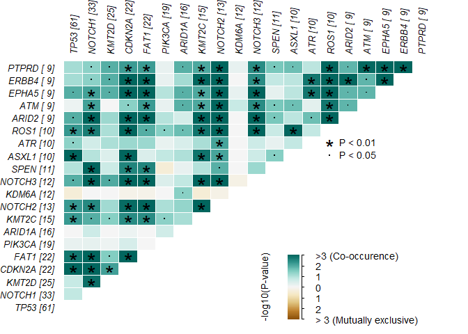<!-- -->

    ##       gene1  gene2       pValue oddsRatio    00    01    11    10         pAdj              Event          pair event_ratio
    ##      <char> <char>        <num>     <num> <int> <int> <int> <int>        <num>             <char>        <char>      <char>
    ##   1:  EPHA5 NOTCH3 2.252408e-07  73.69105   118     5     7     2 4.095287e-06       Co_Occurence EPHA5, NOTCH3         7/7
    ##   2:   FAT1 NOTCH2 4.465747e-07  28.25117   107     3    10    12 6.870659e-06       Co_Occurence  FAT1, NOTCH2       10/15
    ##   3: NOTCH2  EPHA5 4.809461e-07  61.79504   117     2     7     6 6.870659e-06       Co_Occurence EPHA5, NOTCH2         7/8
    ##   4: NOTCH2  PTPRD 4.809461e-07  61.79504   117     2     7     6 6.870659e-06       Co_Occurence NOTCH2, PTPRD         7/8
    ##   5:  ARID2 NOTCH1 1.520148e-06       Inf    99    24     9     0 2.026864e-05       Co_Occurence ARID2, NOTCH1        9/24
    ##  ---                                                                                                                       
    ## 186:  ASXL1  KDM6A 1.000000e+00   1.12017   111    11     1     9 1.000000e+00       Co_Occurence  ASXL1, KDM6A        1/20
    ## 187:    ATR  KDM6A 1.000000e+00   1.12017   111    11     1     9 1.000000e+00       Co_Occurence    ATR, KDM6A        1/20
    ## 188:   ROS1  KDM6A 1.000000e+00   1.12017   111    11     1     9 1.000000e+00       Co_Occurence   KDM6A, ROS1        1/20
    ## 189:  ARID2  KDM6A 1.000000e+00   0.00000   111    12     0     9 1.000000e+00 Mutually_Exclusive  ARID2, KDM6A        0/21
    ## 190:  ERBB4  KDM6A 1.000000e+00   0.00000   111    12     0     9 1.000000e+00 Mutually_Exclusive  ERBB4, KDM6A        0/21

Look for dark green cells with asterisks. These pairs of genes are
frequently mutated together more often than expected by chance (eg.
TP53-CDKN2A). They are might be involved in the same biological pathway,
and mutations in both contribute to disease progression.

Look for dark brown/orange cells with asterisks. These pairs of genes
are rarely mutated together; if one is mutated, the other is often
wild-type (unmutated).

For co-occurring mutations, you might target both pathways
simultaneously. While for mutually exclusive mutations, understanding
which pathway is active (based on the mutated gene) can guide specific
targeted therapies.

### 5. Drug-Gene Interactions

``` r
dgi = drugInteractions(maf, fontSize = 0.75)
```

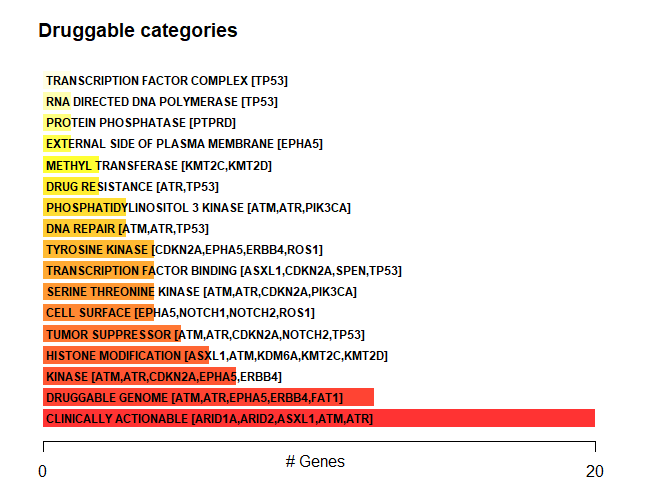<!-- -->

``` r
tp53.dgi = drugInteractions(genes = "TP53", drugs = TRUE)
```

    ## Number of claimed drugs for given genes:
    ##      Gene     N
    ##    <char> <int>
    ## 1:   TP53   193

``` r
tp53.dgi[,.(Gene, interaction_types, drug_name, drug_claim_name)]
```

    ##        Gene interaction_types     drug_name         drug_claim_name
    ##      <char>            <char>        <char>                  <char>
    ##   1:   TP53                                                   CTX-1
    ##   2:   TP53                     GEMCITABINE             Gemcitabine
    ##   3:   TP53                     GRANISETRON             GRANISETRON
    ##   4:   TP53                      EPIRUBICIN              epirubicin
    ##   5:   TP53                                 TOPICAL CORTICOSTEROIDS
    ##  ---                                                               
    ## 189:   TP53                                                CEP-8983
    ## 190:   TP53                     PANITUMUMAB             Panitumumab
    ## 191:   TP53                   STREPTONIGRIN           STREPTONIGRIN
    ## 192:   TP53                      SELICICLIB              Seliciclib
    ## 193:   TP53                                               PD0166285

### 6. Oncogenic Signaling Pathways

``` r
pws = pathways(maf, plotType = 'treemap')
```

    ## Summarizing signalling pathways [Sanchez-Vega et al., https://doi.org/10.1016/j.cell.2018.03.035]

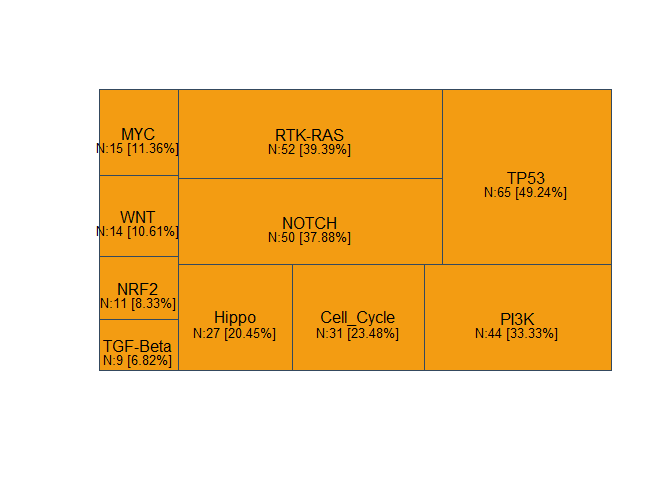<!-- -->

``` r
plotPathways(maf, pathlist = pws)
```

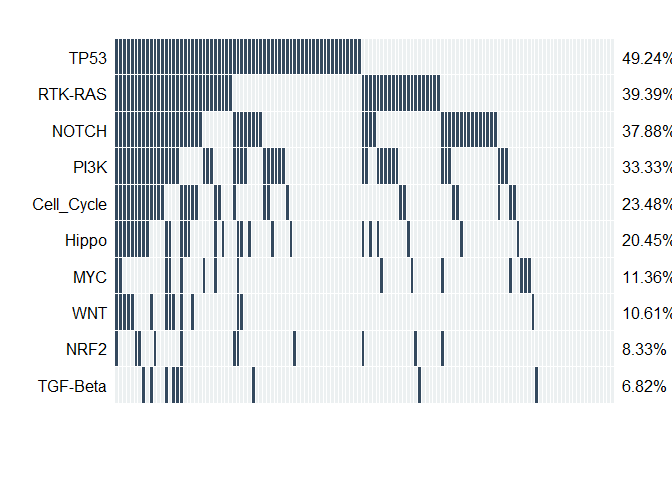<!-- -->

### 7. Pathway Enrichment Analysis of Mutated Genes

``` r
# Load required packages
library(clusterProfiler)
library(org.Hs.eg.db)
library(AnnotationDbi)
library(ggplot2)
```

``` r
# Load mutated genes
mut_genes <- unique(mutations$Hugo_Symbol)
entrez_ids <- bitr(mut_genes, fromType = "SYMBOL", toType = "ENTREZID", OrgDb = org.Hs.eg.db)
```

    ## 'select()' returned 1:1 mapping between keys and columns

    ## Warning in bitr(mut_genes, fromType = "SYMBOL", toType = "ENTREZID", OrgDb = org.Hs.eg.db): 2.78% of input gene IDs are
    ## fail to map...

``` r
# KEGG (Kyoto Encyclopedia of Genes and Genomes) Pathway Enrichment
kegg <- enrichKEGG(gene = entrez_ids$ENTREZID, organism = 'hsa')
barplot(kegg, showCategory = 10) + ggtitle("KEGG Pathway Enrichment")
```

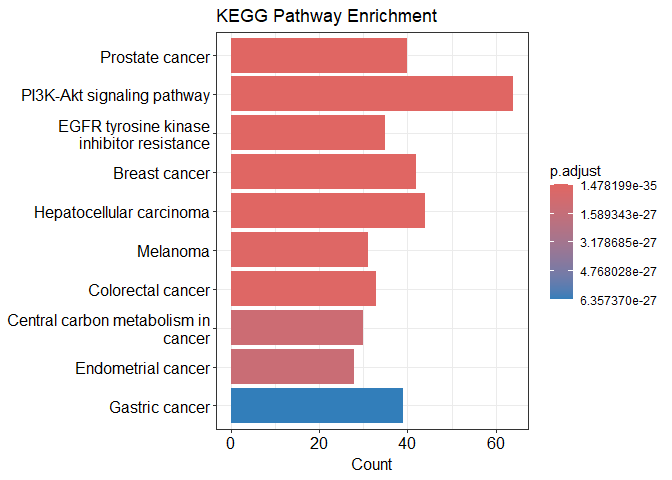<!-- -->

PI3K-Akt signaling pathway is a central and highly active pathway in
your HNC data, indicating its critical role in the disease’s development
and progression.

There is significant molecular overlap between your HNC samples and
other common cancer types, as evidenced by the enrichment of multiple
“cancer” pathways.

EGFR pathway, particularly related to inhibitor resistance, is also
highly implicated, suggesting potential therapeutic vulnerabilities or
resistance mechanisms that need to be considered for HNC treatment.

``` r
# GO (Gene Ontology) Biological Process Enrichment
go <- enrichGO(gene = entrez_ids$ENTREZID, OrgDb = org.Hs.eg.db, ont = "BP", readable = TRUE)
barplot(go, showCategory = 10) + ggtitle("GO Biological Process")
```

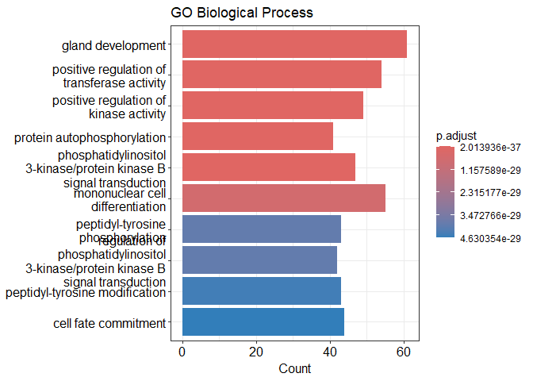<!-- -->

HNC samples exhibit significant deregulation of protein phosphorylation
and kinase activity, pointing to widespread alterations in cellular
signaling networks.

phosphatidylinositol 3-kinase/protein kinase B signal transduction
(highly significant, large count) and regulation of phosphatidylinositol
3-kinase/protein kinase B signal transduction (significant, moderate
count); independently confirm the high importance of the PI3K-Akt
signaling pathway

The strong enrichment of “gland development” and terms related to cell
differentiation/fate suggests that developmental processes are
aberrantly activated or disrupted in HNC samples, potentially
contributing to tumorigenesis.

### 8. Copy Number Alteration (CNA) Landscape

``` r
cna <- fread("hnc_mskcc_2016/data_cna_hg19.seg")
# Convert 'chrom' to factor for proper ordering in plots
cna[, chrom := factor(chrom, levels = unique(chrom[order(as.numeric(chrom))]))]
```

    ## Warning in eval(quote(list(...)), env): NAs introduced by coercion

``` r
# Calculate segment length
cna[, seg.length := loc.end - loc.start]
```

``` r
# Identify gains and losses based on seg.mean
gain_threshold <- 0.2
loss_threshold <- -0.2

cna[, CNA_type := "Neutral"]
cna[seg.mean > gain_threshold, CNA_type := "Gain"]
cna[seg.mean < loss_threshold, CNA_type := "Loss"]
cna[, CNA_type := factor(CNA_type, levels = c("Loss", "Neutral", "Gain"))]
```

``` r
ggplot(cna, aes(x = (loc.start + loc.end) / 2, y = seg.mean, color = CNA_type)) +
  geom_point(alpha = 0.7, size = 1.5) +
  geom_segment(aes(x = loc.start, xend = loc.end, y = seg.mean, yend = seg.mean), size = 1) +
  facet_grid(. ~ chrom, scales = "free_x", space = "free_x") +
  scale_color_manual(values = c("Loss" = "blue", "Neutral" = "grey", "Gain" = "red")) +
  geom_hline(yintercept = 0, linetype = "dashed", color = "black") +
  geom_hline(yintercept = gain_threshold, linetype = "dotted", color = "red") +
  geom_hline(yintercept = loss_threshold, linetype = "dotted", color = "blue") +
  labs(
    title = paste0("Genome-wide Copy Number Profile for ", unique(cna$ID)),
    x = "Genomic Position",
    y = "Segment Mean Log2 Ratio",
    color = "CNA Type"
  ) +
  theme_minimal() +
  theme(
    axis.text.x = element_blank(), # Hide x-axis labels for genomic position
    axis.ticks.x = element_blank(),
    panel.spacing.x = unit(0.1, "cm"),
    strip.text.x = element_text(size = 8),
    legend.position = "bottom"
  )
```

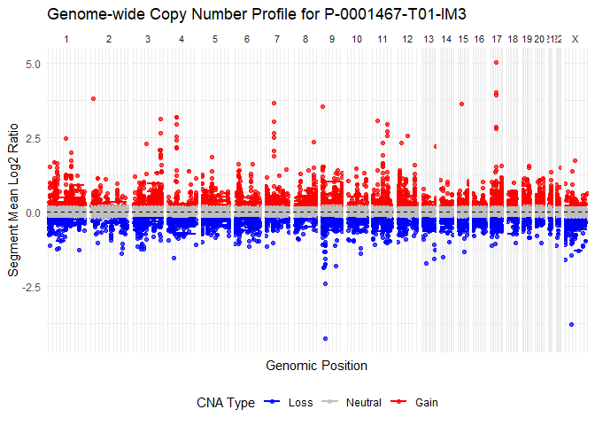<!-- -->

This plot clearly shows that sample P-0001467-T01-IM3 has a highly
altered genome with numerous and significant copy number gains and
losses across many chromosomes, which is characteristic of many types of
cancer.

The specific regions of gain and loss can point to the activation of
oncogenes or inactivation of tumor suppressor genes, which are critical
in cancer development and progression.

``` r
ggplot(cna, aes(x = seg.length / 1e6, y = seg.mean, color = CNA_type)) + # Convert length to Mb
  geom_point(alpha = 0.6) +
  scale_color_manual(values = c("Loss" = "blue", "Neutral" = "grey", "Gain" = "red")) +
  geom_hline(yintercept = 0, linetype = "dashed", color = "black") +
  labs(
    title = "Segment Length vs. Segment Mean Log2 Ratio",
    x = "Segment Length (Mb)",
    y = "Segment Mean Log2 Ratio",
    color = "CNA Type"
  ) +
  theme_minimal() +
  theme(legend.position = "bottom")
```

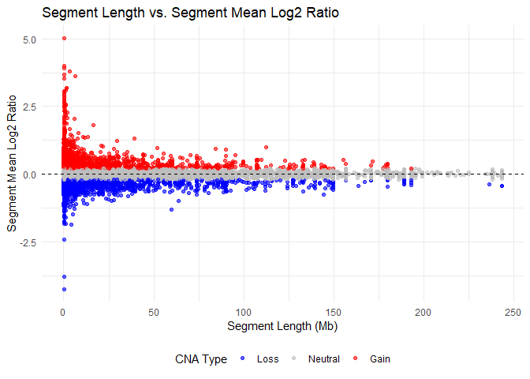<!-- -->

This plot confirms the presence of a wide spectrum of copy number
alterations in the sample, ranging from small, high-magnitude focal
events (both gains and losses) to larger, lower-magnitude arm-level or
chromosomal alterations.

The abundance of both high-level amplifications and deep deletions,
especially at shorter lengths, reinforces the idea of significant
genomic instability and the likely presence of functionally important
driver CNAs in this sample.

### 9. Tumor Mutational Burden (TMB) Comparison

``` r
# Prepare TMB data
clin.sample <- read.delim("hnc_mskcc_2016/data_clinical_sample.txt", skip = 4)
tmb <- data.frame(SAMPLE_ID = clin.sample$SAMPLE_ID,
                  TMB_NONSYNONYMOUS = clin.sample$TMB_NONSYNONYMOUS,
                  HPV_STATUS = clin.patient$HPV_STATUS)
```

``` r
ggplot(tmb, aes(x = HPV_STATUS, y = TMB_NONSYNONYMOUS, fill = HPV_STATUS)) +
  geom_boxplot() +
  scale_y_log10() +
  theme_minimal() +
  labs(title = "Tumor Mutational Burden by HPV Status", y = "TMB (log scale)")
```

    ## Warning in scale_y_log10(): log-10 transformation introduced infinite values.

    ## Warning: Removed 25 rows containing non-finite outside the scale range (`stat_boxplot()`).

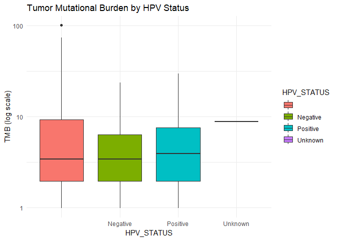<!-- -->

### 10. Circos Plot of Structural Variants

``` r
# Load required package
library(circlize)

# Load SV data
sv <- fread("hnc_mskcc_2016/data_sv.txt")
sv_data <- sv[!is.na(sv$Site1_Chromosome) & !is.na(sv$Site2_Chromosome), ]
```

``` r
# Preparation of chords data
chords <- data.frame(
  chr1 = paste0("chr", sv_data$Site1_Chromosome),
  pos1 = sv_data$Site1_Position,
  chr2 = paste0("chr", sv_data$Site2_Chromosome),
  pos2 = sv_data$Site2_Position
)
```

``` r
# Construct circos plot
circos.clear()
circos.initializeWithIdeogram(species = "hg19")
circos.genomicLink(chords[,1:2], chords[,3:4], col = "red")
```

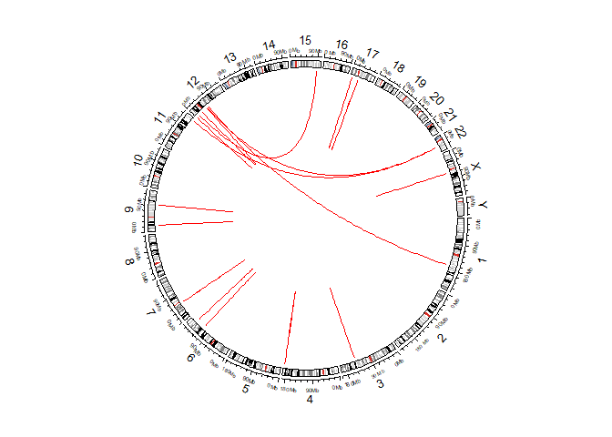<!-- -->

This plot gives the information about inter- and intra- chromosomal
translocations. Intrachromosomal translocations involve a segment moving
to a different location on the same chromosome, while interchromosomal
translocations involve a segment moving between two different
chromosomes.

Inter-chromosomal translocations - chr1-chr12, chr12-chr15, chr11-chr22
and chr12-chr22. Intra-chromosomal translocations - chr3, chr4, chr6,
chr7, chr9, chr12, chr17 and chrX.

### 11. Mutational Signature Analysis

``` r
# Required package
library(deconstructSigs)
```

``` r
# Input: mutation context (need VCF-like info)
sigs_input <- mut.to.sigs.input(
  mut.ref = mutations,
  sample.id = "Tumor_Sample_Barcode",
  chr = "Chromosome",
  pos = "Start_Position",
  ref = "Reference_Allele",
  alt = "Tumor_Seq_Allele2"
)
```

    ## Warning in mut.to.sigs.input(mut.ref = mutations, sample.id = "Tumor_Sample_Barcode", : Some samples have fewer than 50 mutations:
    ##   P-0000202-T01-IM3, P-0000206-T01-IM3, P-0000237-T01-IM3, P-0000284-T01-IM3, P-0000319-T01-IM3, P-0000340-T01-IM3, P-0000374-T01-IM3, P-0000396-T01-IM3, P-0000433-T01-IM3, P-0000434-T01-IM3, P-0000454-T01-IM3, P-0000467-T01-IM3, P-0000489-T01-IM3, P-0000507-T01-IM3, P-0000524-T01-IM3, P-0000573-T01-IM3, P-0000586-T01-IM3, P-0000618-T01-IM3, P-0000621-T01-IM3, P-0000623-T01-IM3, P-0000668-T01-IM3, P-0000705-T01-IM3, P-0000717-T01-IM3, P-0000768-T01-IM3, P-0000775-T01-IM3, P-0000790-T01-IM3, P-0000910-T01-IM3, P-0000919-T01-IM3, P-0000951-T01-IM3, P-0000957-T01-IM3, P-0000980-T01-IM3, P-0001082-T01-IM3, P-0001186-T01-IM3, P-0001195-T01-IM3, P-0001201-T01-IM3, P-0001214-T01-IM3, P-0001239-T01-IM3, P-0001327-T01-IM3, P-0001363-T01-IM3, P-0001416-T01-IM3, P-0001422-T01-IM3, P-0001451-T01-IM3, P-0001467-T01-IM3, P-0001538-T01-IM3, P-0001557-T01-IM3, P-0001598-T01-IM3, P-0001614-T01-IM3, P-0001621-T01-IM3, P-0001641-T01-IM3, P-0001682-T01-IM3, P-0001736-T01-IM3, P-0001794-T01-IM3, P-0001903-T01-IM3, P-0002073-T01-IM3, P-0002108-T01-IM3, P-0002168-T01-IM3, P-0002185-T01-IM3, P-0002189-T01-IM3, P-0002193-T01-IM3, P-0002209-T01-IM3, P-0002367-T01-IM3, P-0002411-T01-IM3, P-0002469-T01-IM3, P-0002486-T01-IM3, P-0002508-T01-IM3, P-0002592-T01-IM3, P-0002603-T01-IM3, P-0002745-T01-IM3, P-0002750-T02-IM3, P-0002787-T01-IM3, P-0002818-T01-IM3, P-0002920-T01-IM3, P-0002939-T01-IM3, P-0002948-T02-IM5, P-0002978-T02-IM5, P-0003009-T01-IM3, P-0003016-T01-IM3, P-0003031-T01-IM5, P-0003049-T01-IM3, P-0003053-T01-IM3, P-0003056-T01-IM3, P-0003059-T01-IM3, P-0003080-T01-IM5, P-0003104-T01-IM5, P-0003106-T01-IM5, P-0003161-T01-IM5, P-0003239-T01-IM5, P-0003277-T01-IM5, P-0003293-T01-IM5, P-0003320-T01-IM5, P-0003327-T01-IM5, P-0003331-T01-IM5, P-0003338-T01-IM5, P-0003469-T01-IM5, P-0003500-T01-IM5, P-0003532-T01-IM5, P-0003610-T01-IM5, P-0003646-T01-IM5, P-0003699-T01-IM5, P-0003711-T01-IM5, P-0003821-T01-IM5, P-0003857-T01-IM5, P-0003928-T01-IM5, P-0003951-T01-IM3, P-0004055-T01-IM5, P-0004130-T02-IM5, P-0004174-T01-IM5, P-0004334-T01-IM5, P-0004352-T01-IM5, P-0004371-T01-IM5, P-0004416-T01-IM5, P-0004492-T01-IM5, P-0004614-T01-IM5, P-0004641-T01-IM5, P-0005209-T01-IM5, P-0006480-T01-IM5

``` r
sigs_output <- whichSignatures(tumor.ref = sigs_input,
                               signatures.ref = signatures.cosmic,
                               sample.id = "P-0001467-T01-IM3",
                               contexts.needed = TRUE)
```

``` r
# Plot mutational signatures
plotSignatures(sigs_output)
```

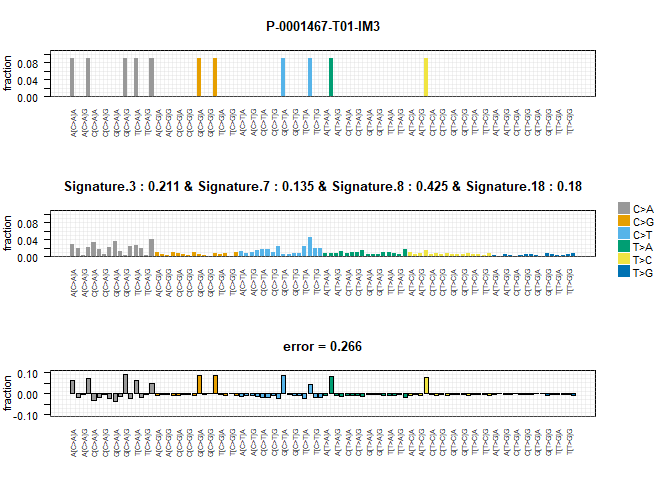<!-- -->

This is the 96-triplet mutation profile. For specific tumor sample
P-0001487-701-IM3; its observed mutational landscape is best explained
by the activity of four distinct mutational processes: Signature 8 (most
prominent), Signature 3, Signature 18, and Signature 7.

Presence of Signature 3 suggests potential homologous recombination
deficiency in this tumor, which could have implications for treatment
(e.g., sensitivity to PARP inhibitors).

Presence of Signature 7 indicates prior exposure to UV radiation,
suggesting this tumor might be a skin cancer (melanoma or squamous cell
carcinoma) or has acquired this damage irrespective of its origin.

Signature 8 and 18 contribute significantly, indicating other active
mutational processes, whose precise biological mechanisms might require
further investigation.

“error = 0.266” value quantifies the overall discrepancy between the
observed and reconstructed profiles. A smaller error indicates a better
fit. (Quality of fit)

### 12. Recurrent Fusions in Metastatic Disease

``` r
# Prepare fusion counts data
sv.merge <- inner_join(sv, clin.sample %>% dplyr::select(SAMPLE_ID, SAMPLE_TYPE), by=c("Sample_Id" = "SAMPLE_ID"))

fusion_counts <- sv.merge %>%
  dplyr::mutate(fusion = paste(Site1_Hugo_Symbol, Site2_Hugo_Symbol, sep = "--")) %>%
  group_by(fusion, SAMPLE_TYPE) %>%
  tally()
```

``` r
ggplot(fusion_counts, aes(x=fusion, y=n, fill = SAMPLE_TYPE)) +
  geom_col(position = "dodge") + coord_flip() +
  labs(title = "Recurrent Fusions by Sample Type")
```

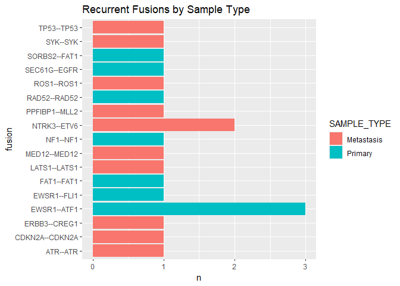<!-- -->

### Conclusion

This analysis provides an overview of mutational alterations in cancer,
from variant level annotation to clinical outcomes and pathway
implications. The multi-dimensional integration of context is important
in identifying clinically and biologically relevant insights which will
contribute to our understanding of the process of tumorigenesis and
provide possible therapeutic options.
